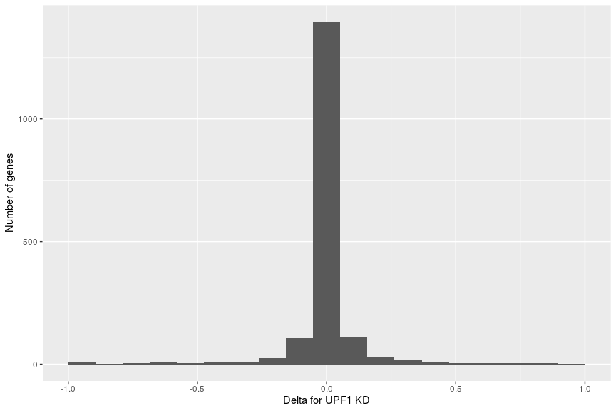
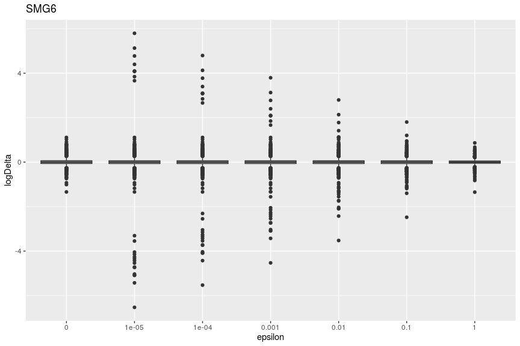
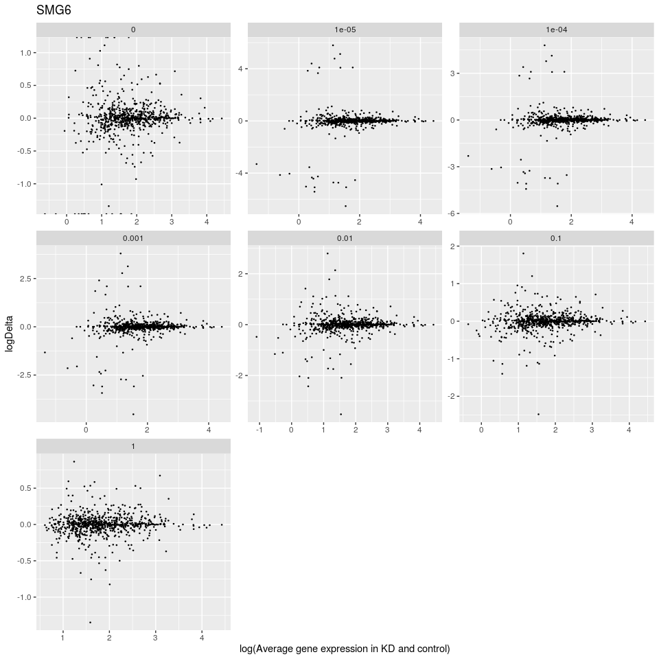
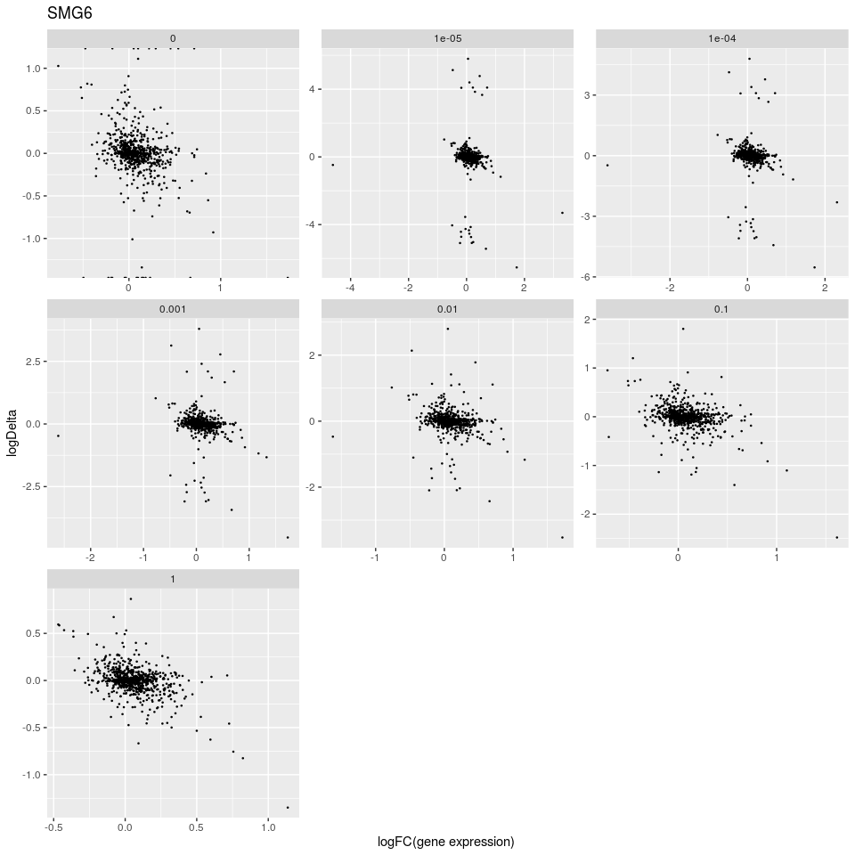
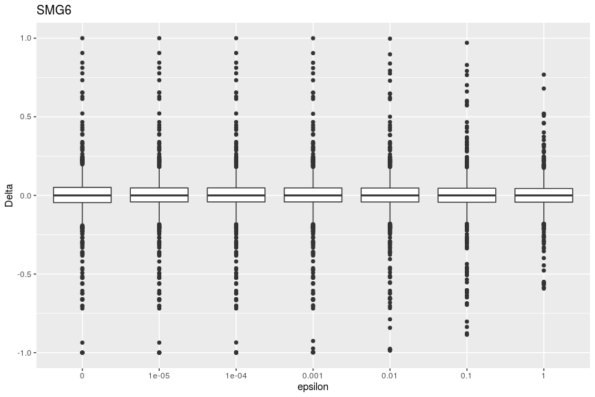
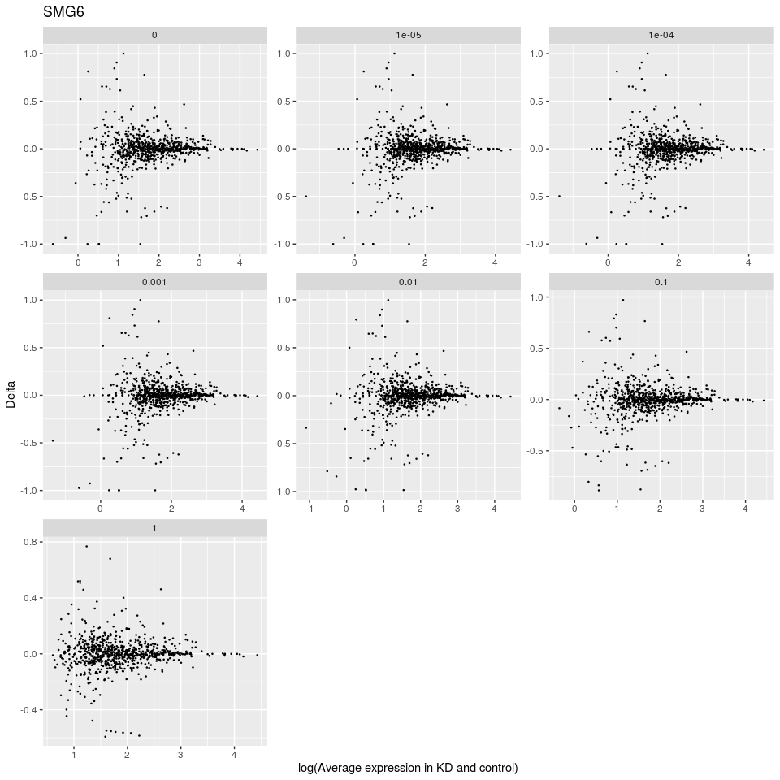
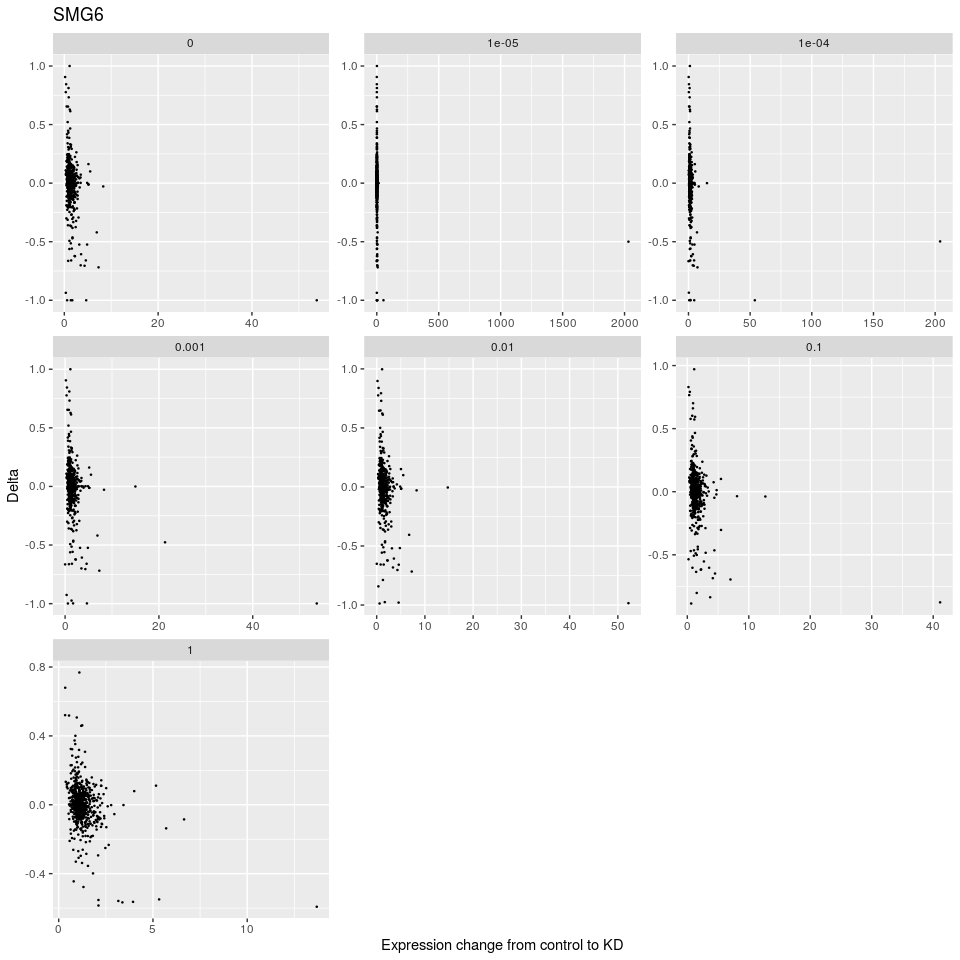

Plots
================

Data
itself:

``` r
kable(head(target_counts_by_eps))
```

| gene\_id           | gene\_name | cancer\_gene | self\_rbp | shRNA\_KD | uorftx\_number | alltx\_number | eps | avg\_kozak\_score | max\_kozak\_score | uorftx\_tpm\_control | uorftx\_tpm\_smg6 | uorftx\_tpm\_upf1 | gene\_tpm\_control | gene\_tpm\_smg6 | gene\_tpm\_upf1 | frac\_control | frac\_smg6 | frac\_upf1 |
| :----------------- | :--------- | :----------- | :-------- | :-------- | -------------: | ------------: | --: | ----------------: | ----------------: | -------------------: | ----------------: | ----------------: | -----------------: | --------------: | --------------: | ------------: | ---------: | ---------: |
| ENSG00000130939.14 | UBE4B      | FALSE        | FALSE     | FALSE     |              1 |             1 |   0 |         0.6545584 |         0.6545584 |             4.803850 |          6.320538 |          6.534992 |           4.803850 |        6.320538 |        6.534992 |     1.0000000 |          1 |  1.0000000 |
| ENSG00000142655.8  | PEX14      | FALSE        | FALSE     | FALSE     |              1 |             2 |   0 |         0.2319045 |         0.2319045 |            37.111135 |         35.921655 |         28.905457 |          40.879122 |       35.921655 |       32.434899 |     0.9078261 |          1 |  0.8911838 |
| ENSG00000116688.12 | MFN2       | FALSE        | FALSE     | FALSE     |              2 |             2 |   0 |         0.6875880 |         0.6875880 |            24.696599 |         21.861144 |         29.798380 |          24.696599 |       21.861144 |       29.798380 |     1.0000000 |          1 |  1.0000000 |
| ENSG00000116691.6  | MIIP       | FALSE        | FALSE     | FALSE     |              1 |             2 |   0 |         0.2894018 |         0.2894018 |             1.627398 |          2.532337 |          2.403440 |           1.627398 |        2.532337 |        8.175462 |     1.0000000 |          1 |  0.2939822 |
| ENSG00000162458.8  | FBLIM1     | FALSE        | FALSE     | FALSE     |              3 |             3 |   0 |         0.6651838 |         0.6651838 |             0.564319 |          1.249094 |          0.838407 |           0.564319 |        1.249094 |        0.838407 |     1.0000000 |          1 |  1.0000000 |
| ENSG00000065526.6  | SPEN       | TRUE         | FALSE     | FALSE     |              1 |             1 |   0 |         0.9256631 |         0.9256631 |             5.375528 |          4.599448 |          6.179964 |           5.375528 |        4.599448 |        6.179964 |     1.0000000 |          1 |  1.0000000 |

Number of genes:

``` r
(number_of_all_genes <- length(unique(target_counts_by_eps$gene_id)))
```

    ## [1] 1765

Distribution of delta in case of UPF1 knockdown with eps = 0:

``` r
qplot(
  x = delta_upf1,
  data = target_counts_by_eps %>%
    filter(eps == 0) %>%
    transmute(delta_upf1 = frac_upf1 - frac_control),
  bins = 20,
  xlab = 'Delta for UPF1 KD',
  ylab = 'Number of genes'
)
```

    ## Warning: Removed 10 rows containing non-finite values (stat_bin).

<!-- -->

A lot of genes have delta = 0.  
Let’s define some subsetting
rules:

``` r
keep_expressed_genes <- target_counts_by_eps$uorftx_number != target_counts_by_eps$alltx_number
keep_target_genes <- target_counts_by_eps$uorftx_number != target_counts_by_eps$alltx_number
sprintf("Number of genes having both uORF and non-uORF transcripts = %d",
        sum(keep_target_genes[1:number_of_all_genes]))
```

    ## [1] "Number of genes having both uORF and non-uORF transcripts = 776"

``` r
keep_smg6_delta <- (target_counts_by_eps$gene_tpm_smg6 != 0) & (target_counts_by_eps$frac_smg6 != target_counts_by_eps$frac_control)
sprintf("Number of genes with non-zero delta in SMG6 knockdown = %d",
        sum(keep_smg6_delta[1:number_of_all_genes]))
```

    ## [1] "Number of genes with non-zero delta in SMG6 knockdown = 726"

``` r
keep_upf1_delta <- (target_counts_by_eps$gene_tpm_upf1 != 0) & (target_counts_by_eps$frac_upf1 != target_counts_by_eps$frac_control)
sprintf("Number of genes with non-zero delta in UPF1 knockdown = %d",
        sum(keep_upf1_delta[1:number_of_all_genes]))
```

    ## [1] "Number of genes with non-zero delta in UPF1 knockdown = 734"

### Logarithmic plots

SMG6 data by different epsilon (with removing zero delta genes):

``` r
ggplot(data = target_counts_by_eps[keep_smg6_delta, ], mapping = aes(
  x = as.factor(eps), y = log10(frac_smg6) - log10(frac_control)
)) + geom_boxplot() + ggtitle('SMG6') + 
  xlab('epsilon') + ylab('logDelta')
```

    ## Warning: Removed 23 rows containing non-finite values (stat_boxplot).

<!-- -->

Delta against average gene expression in KD (SMG6) and control by
different epsilon:

``` r
ggplot(data = target_counts_by_eps[keep_smg6_delta, ], mapping = aes(
  x = log10(gene_tpm_smg6 + gene_tpm_control),
  y = log10(frac_smg6) - log10(frac_control)
)) + geom_point(size = 0.25) + ggtitle('SMG6') +
  facet_wrap(~ as.factor(eps), scales = 'free', labeller = label_parsed) + 
  xlab('log(Average gene expression in KD and control)') + ylab('logDelta')
```

<!-- -->

Logarithmic delta against gene expression change for SMG6 KD:

``` r
ggplot(data = target_counts_by_eps[keep_smg6_delta, ], 
       mapping = aes(
         x = log10(gene_tpm_smg6 / gene_tpm_control),
         y = log10(frac_smg6) - log10(frac_control)
)) + geom_point(size = 0.25) + ggtitle('SMG6') +
  facet_wrap(~ factor(eps), scales = 'free') + 
  xlab('logFC(gene expression) ') + ylab('logDelta')
```

<!-- -->

### Non-logarithmic plots

Boxplots for different epsilon:

``` r
ggplot(data = target_counts_by_eps[keep_smg6_delta, ],
       mapping = aes(x = as.factor(eps), y = frac_smg6 - frac_control)) +
  geom_boxplot() + ggtitle('SMG6') + 
  xlab('epsilon') + ylab('Delta')
```

<!-- -->

Delta against log of average expression in KD (SMG6) and control:

``` r
ggplot(data = target_counts_by_eps[keep_smg6_delta, ],
       mapping = aes(x = log10(gene_tpm_smg6 + gene_tpm_control), y = frac_smg6 - frac_control)) +
  geom_point(size = 0.25) + ggtitle('SMG6') +
  facet_wrap(~ as.factor(eps), scales = 'free', labeller = label_parsed) + 
  xlab('log(Average expression in KD and control)') + ylab('Delta')
```

<!-- -->

Delta against gene expression change for SMG6 KD:

``` r
ggplot(data = target_counts_by_eps[keep_smg6_delta, ], 
       mapping = aes(x = gene_tpm_smg6 / gene_tpm_control, y = frac_smg6 - frac_control)) +
  geom_point(size = 0.25) + ggtitle('SMG6') +
  facet_wrap(~ factor(eps), scales = 'free') + 
  xlab('Expression change from control to KD') + ylab('Delta')
```

<!-- -->

It’s better to avoid small values of epsilon.
