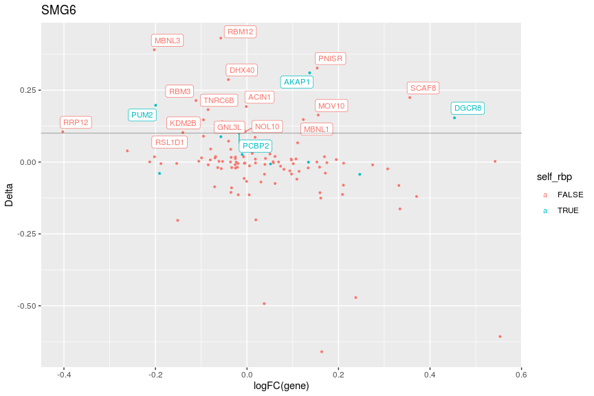

Investigating genes
================

``` r
library(tidyverse)
```

    ## ── Attaching packages ──────────────────────────────────────────────────────────────── tidyverse 1.3.0 ──

    ## ✓ ggplot2 3.3.0     ✓ purrr   0.3.3
    ## ✓ tibble  3.0.0     ✓ dplyr   0.8.5
    ## ✓ tidyr   1.0.2     ✓ stringr 1.4.0
    ## ✓ readr   1.3.1     ✓ forcats 0.5.0

    ## ── Conflicts ─────────────────────────────────────────────────────────────────── tidyverse_conflicts() ──
    ## x dplyr::filter() masks stats::filter()
    ## x dplyr::lag()    masks stats::lag()

``` r
library(knitr)
gd <- read_tsv('gene_table.tsv')
```

    ## Parsed with column specification:
    ## cols(
    ##   .default = col_double(),
    ##   gene_id = col_character(),
    ##   gene_name = col_character(),
    ##   desc = col_character(),
    ##   tx_names = col_character(),
    ##   is_rbp = col_logical(),
    ##   self_rbp = col_logical(),
    ##   is_cancer_gene = col_logical()
    ## )

    ## See spec(...) for full column specifications.

``` r
kable(head(gd))
```

| gene\_id           | gene\_name | entrez\_id | desc                                      | tx\_names                                               | is\_rbp | self\_rbp | is\_cancer\_gene | uorf\_tx\_number | all\_tx\_number | max\_uorf\_kozak\_score | max\_main\_kozak\_score | diff\_score | delta\_smg6 | delta\_upf1 | delta\_KD | nmd\_gene\_control\_tpm | nmd\_gene\_smg6\_tpm | nmd\_gene\_upf1\_tpm | nmd\_uorf\_tx\_control\_tpm | nmd\_uorf\_tx\_smg6\_tpm | nmd\_uorf\_tx\_upf1\_tpm | nmd\_frac\_control | nmd\_frac\_smg6 | nmd\_frac\_upf1 | kd\_gene\_control\_tpm | kd\_gene\_knockdown\_tpm | kd\_uorf\_tx\_control\_tpm | kd\_uorf\_tx\_knockdown\_tpm | kd\_frac\_control | kd\_frac\_knockdown |
| :----------------- | :--------- | ---------: | :---------------------------------------- | :------------------------------------------------------ | :------ | :-------- | :--------------- | ---------------: | --------------: | ----------------------: | ----------------------: | ----------: | ----------: | ----------: | --------: | ----------------------: | -------------------: | -------------------: | --------------------------: | -----------------------: | -----------------------: | -----------------: | --------------: | --------------: | ---------------------: | -----------------------: | -------------------------: | ---------------------------: | ----------------: | ------------------: |
| ENSG00000130939.14 | UBE4B      |      10277 | ubiquitination factor E4B                 | ENST00000377157.3                                       | FALSE   | FALSE     | FALSE            |                1 |               1 |               0.6545584 |               0.8852467 | \-0.2306883 |   0.0000000 |   0.0000000 |        NA |                4.803850 |             6.320538 |             6.534992 |                    4.803850 |                 6.320538 |                 6.534992 |          1.0000000 |               1 |       1.0000000 |                     NA |                       NA |                         NA |                           NA |                NA |                  NA |
| ENSG00000142655.8  | PEX14      |       5195 | peroxisomal biogenesis factor 14          | ENST00000356607.4, ENST00000538836.1                    | FALSE   | FALSE     | FALSE            |                1 |               2 |               0.2319045 |               0.9486953 | \-0.7167908 |   0.0921739 | \-0.0166423 |        NA |               40.879122 |            35.921655 |            32.434899 |                   37.111135 |                35.921655 |                28.905457 |          0.9078261 |               1 |       0.8911838 |                     NA |                       NA |                         NA |                           NA |                NA |                  NA |
| ENSG00000116688.12 | MFN2       |       9927 | mitofusin 2                               | ENST00000444836.1, ENST00000235329.5                    | FALSE   | FALSE     | FALSE            |                2 |               2 |               0.6875880 |               0.9102993 | \-0.2227113 |   0.0000000 |   0.0000000 |        NA |               24.696599 |            21.861144 |            29.798380 |                   24.696599 |                21.861144 |                29.798380 |          1.0000000 |               1 |       1.0000000 |                     NA |                       NA |                         NA |                           NA |                NA |                  NA |
| ENSG00000116691.6  | MIIP       |      60672 | migration and invasion inhibitory protein | ENST00000235332.4, ENST00000436478.2                    | FALSE   | FALSE     | FALSE            |                1 |               2 |               0.2894018 |               0.9500326 | \-0.6606308 |   0.0000000 | \-0.7060178 |        NA |                1.627398 |             2.532337 |             8.175462 |                    1.627398 |                 2.532337 |                 2.403440 |          1.0000000 |               1 |       0.2939822 |                     NA |                       NA |                         NA |                           NA |                NA |                  NA |
| ENSG00000162458.8  | FBLIM1     |      54751 | filamin binding LIM protein 1             | ENST00000375766.3, ENST00000400773.1, ENST00000441801.2 | FALSE   | FALSE     | FALSE            |                3 |               3 |               0.6651838 |               0.9545771 | \-0.2893932 |   0.0000000 |   0.0000000 |        NA |                0.564319 |             1.249094 |             0.838407 |                    0.564319 |                 1.249094 |                 0.838407 |          1.0000000 |               1 |       1.0000000 |                     NA |                       NA |                         NA |                           NA |                NA |                  NA |
| ENSG00000065526.6  | SPEN       |      23013 | spen family transcriptional repressor     | ENST00000375759.3                                       | TRUE    | FALSE     | TRUE             |                1 |               1 |               0.9256631 |               0.9637119 | \-0.0380489 |   0.0000000 |   0.0000000 |        NA |                5.375528 |             4.599448 |             6.179964 |                    5.375528 |                 4.599448 |                 6.179964 |          1.0000000 |               1 |       1.0000000 |                     NA |                       NA |                         NA |                           NA |                NA |                  NA |

Subsetting rules:

``` r
keep_upf1 <- (gd$nmd_gene_upf1_tpm > 0) & (gd$delta_upf1 != 0)
keep_smg6 <- (gd$nmd_gene_smg6_tpm > 0) & (gd$delta_smg6 != 0)
```

And let’s define top genes for each knockdown:

``` r
positive_smg6 <- gd %>%
  filter(keep_smg6, delta_smg6 > 0) %>% 
  select(gene_name, entrez_id, delta_smg6) %>% 
  arrange(desc(delta_smg6))
kable(head(positive_smg6))
```

| gene\_name | entrez\_id | delta\_smg6 |
| :--------- | ---------: | ----------: |
| ZNF250     |      58500 |   1.0000000 |
| DUSP22     |      56940 |   0.9060186 |
| NCAPH2     |      29781 |   0.8445142 |
| CDH24      |      64403 |   0.8117342 |
| C11orf49   |      79096 |   0.7768329 |
| GPAA1      |       8733 |   0.7327145 |

``` r
positive_upf1 <- gd %>%
  filter(keep_upf1, delta_upf1 > 0) %>% 
  select(gene_name, entrez_id, delta_upf1) %>% 
  arrange(desc(delta_upf1))
kable(head(positive_upf1))
```

| gene\_name | entrez\_id | delta\_upf1 |
| :--------- | ---------: | ----------: |
| ZNF304     |      57343 |   1.0000000 |
| DUSP22     |      56940 |   0.9060186 |
| ARAF       |        369 |   0.8592094 |
| U2AF2      |      11338 |   0.8363291 |
| CDH24      |      64403 |   0.8117342 |
| FAM63B     |         NA |   0.7725336 |

Now let’s enrich their
intersection:

``` r
positive_genes <- intersect(positive_smg6$gene_name, positive_upf1$gene_name)
write_lines(x = positive_genes, path = 'positive_genes.txt')
```

``` r
enr <- read_tsv('msigdb_results.tsv')
```

    ## Parsed with column specification:
    ## cols(
    ##   `Gene Set Name` = col_character(),
    ##   `# Genes in Gene Set (K)` = col_double(),
    ##   Description = col_character(),
    ##   `# Genes in Overlap (k)` = col_double(),
    ##   `k/K` = col_double(),
    ##   `p-value` = col_double(),
    ##   `FDR q-value` = col_double()
    ## )

``` r
colnames(enr) <- c('gene_set_name', 'genes_in_gene_set', 'description',
                   'genes_in_overlap', 'k/K', 'p_value', 'q_value')
kable(enr)
```

| gene\_set\_name                          | genes\_in\_gene\_set | description                                                                                                                                                                                                                                                                                                                                                                                                                                                                                                                                                                                                                                                                | genes\_in\_overlap |    k/K | p\_value | q\_value |
| :--------------------------------------- | -------------------: | :------------------------------------------------------------------------------------------------------------------------------------------------------------------------------------------------------------------------------------------------------------------------------------------------------------------------------------------------------------------------------------------------------------------------------------------------------------------------------------------------------------------------------------------------------------------------------------------------------------------------------------------------------------------------- | -----------------: | -----: | -------: | -------: |
| DIAZ\_CHRONIC\_MEYLOGENOUS\_LEUKEMIA\_UP |                 1399 | Genes up-regulated in CD34+ \[GeneID=947\] cells isolated from bone marrow of CML (chronic myelogenous leukemia) patients, compared to those from normal donors.                                                                                                                                                                                                                                                                                                                                                                                                                                                                                                           |                 56 | 0.0400 |        0 |        0 |
| HOXC6\_TARGET\_GENES                     |                 1171 | Genes containing one or more binding sites for UniProt:P09630 (HOXC6) in their promoter region (TSS -1000,+100 bp) as identified by GTRD version 19.10 ChIP-seq harmonization.                                                                                                                                                                                                                                                                                                                                                                                                                                                                                             |                 46 | 0.0393 |        0 |        0 |
| JDP2\_TARGET\_GENES                      |                 1880 | Genes containing one or more binding sites for UniProt:Q8WYK2 (JDP2) in their promoter region (TSS -1000,+100 bp) as identified by GTRD version 19.10 ChIP-seq harmonization.                                                                                                                                                                                                                                                                                                                                                                                                                                                                                              |                 56 | 0.0298 |        0 |        0 |
| GO\_RNA\_BINDING                         |                 1901 | Interacting selectively and non-covalently with an RNA molecule or a portion thereof. \[GOC:jl, GOC:mah\]                                                                                                                                                                                                                                                                                                                                                                                                                                                                                                                                                                  |                 56 | 0.0295 |        0 |        0 |
| DIDO1\_TARGET\_GENES                     |                 1587 | Genes containing one or more binding sites for UniProt:Q9BTC0 (DIDO1) in their promoter region (TSS -1000,+100 bp) as identified by GTRD version 19.10 ChIP-seq harmonization.                                                                                                                                                                                                                                                                                                                                                                                                                                                                                             |                 51 | 0.0321 |        0 |        0 |
| ZNF711\_TARGET\_GENES                    |                 1678 | Genes containing one or more binding sites for UniProt:Q9Y462 (ZNF711) in their promoter region (TSS -1000,+100 bp) as identified by GTRD version 19.10 ChIP-seq harmonization.                                                                                                                                                                                                                                                                                                                                                                                                                                                                                            |                 52 | 0.0310 |        0 |        0 |
| PUJANA\_BRCA1\_PCC\_NETWORK              |                 1627 | Genes constituting the BRCA1-PCC network of transcripts whose expression positively correlated (Pearson correlation coefficient, PCC \>= 0.4) with that of BRCA1 \[GeneID=672\] across a compendium of normal tissues.                                                                                                                                                                                                                                                                                                                                                                                                                                                     |                 51 | 0.0313 |        0 |        0 |
| FISCHER\_DREAM\_TARGETS                  |                  967 | Target genes of the DREAM complex.                                                                                                                                                                                                                                                                                                                                                                                                                                                                                                                                                                                                                                         |                 40 | 0.0414 |        0 |        0 |
| GO\_NUCLEOLUS                            |                  914 | A small, dense body one or more of which are present in the nucleus of eukaryotic cells. It is rich in RNA and protein, is not bounded by a limiting membrane, and is not seen during mitosis. Its prime function is the transcription of the nucleolar DNA into 45S ribosomal-precursor RNA, the processing of this RNA into 5.8S, 18S, and 28S components of ribosomal RNA, and the association of these components with 5S RNA and proteins synthesized outside the nucleolus. This association results in the formation of ribonucleoprotein precursors; these pass into the cytoplasm and mature into the 40S and 60S subunits of the ribosome. \[<ISBN:0198506732>\] |                 39 | 0.0427 |        0 |        0 |
| GRYDER\_PAX3FOXO1\_ENHANCERS\_IN\_TADS   |                 1009 | Expressed genes (FPKM\>1) associated with high-confidence PAX3-FOXO1 sites with enhancers in primary tumors and cell lines, restricted to those within topological domain boundaries                                                                                                                                                                                                                                                                                                                                                                                                                                                                                       |                 40 | 0.0396 |        0 |        0 |
| DBP\_TARGET\_GENES                       |                 1430 | Genes containing one or more binding sites for UniProt:Q10586 (DBP) in their promoter region (TSS -1000,+100 bp) as identified by GTRD version 19.10 ChIP-seq harmonization.                                                                                                                                                                                                                                                                                                                                                                                                                                                                                               |                 47 | 0.0329 |        0 |        0 |
| CAIRO\_HEPATOBLASTOMA\_CLASSES\_UP       |                  611 | Genes up-regulated in robust Cluster 2 (rC2) of hepatoblastoma samples compared to those in the robust Cluster 1 (rC1).                                                                                                                                                                                                                                                                                                                                                                                                                                                                                                                                                    |                 32 | 0.0524 |        0 |        0 |
| MORC2\_TARGET\_GENES                     |                 1989 | Genes containing one or more binding sites for UniProt:Q9Y6X9 (MORC2) in their promoter region (TSS -1000,+100 bp) as identified by GTRD version 19.10 ChIP-seq harmonization.                                                                                                                                                                                                                                                                                                                                                                                                                                                                                             |                 55 | 0.0277 |        0 |        0 |
| MTA1\_TARGET\_GENES                      |                 1993 | Genes containing one or more binding sites for UniProt:Q13330 (MTA1) in their promoter region (TSS -1000,+100 bp) as identified by GTRD version 19.10 ChIP-seq harmonization.                                                                                                                                                                                                                                                                                                                                                                                                                                                                                              |                 55 | 0.0276 |        0 |        0 |
| PRDM6\_TARGET\_GENES                     |                 1861 | Genes containing one or more binding sites for UniProt:Q9NQX0 (PRDM6) in their promoter region (TSS -1000,+100 bp) as identified by GTRD version 19.10 ChIP-seq harmonization.                                                                                                                                                                                                                                                                                                                                                                                                                                                                                             |                 53 | 0.0285 |        0 |        0 |
| ZNF407\_TARGET\_GENES                    |                 1879 | Genes containing one or more binding sites for UniProt:Q9C0G0 (ZNF407) in their promoter region (TSS -1000,+100 bp) as identified by GTRD version 19.10 ChIP-seq harmonization.                                                                                                                                                                                                                                                                                                                                                                                                                                                                                            |                 53 | 0.0282 |        0 |        0 |
| E2F2\_TARGET\_GENES                      |                 1445 | Genes containing one or more binding sites for UniProt:Q14209 (E2F2) in their promoter region (TSS -1000,+100 bp) as identified by GTRD version 19.10 ChIP-seq harmonization.                                                                                                                                                                                                                                                                                                                                                                                                                                                                                              |                 46 | 0.0318 |        0 |        0 |
| SCGGAAGY\_ELK1\_02                       |                 1234 | Genes having at least one occurence of the highly conserved motif M3 SCGGAAGY sites. The motif matches transcription factor binding site V$ELK1\_02 (v7.4 TRANSFAC).                                                                                                                                                                                                                                                                                                                                                                                                                                                                                                       |                 42 | 0.0340 |        0 |        0 |
| SALL4\_TARGET\_GENES                     |                 1793 | Genes containing one or more binding sites for UniProt:Q9UJQ4 (SALL4) in their promoter region (TSS -1000,+100 bp) as identified by GTRD version 19.10 ChIP-seq harmonization.                                                                                                                                                                                                                                                                                                                                                                                                                                                                                             |                 50 | 0.0279 |        0 |        0 |
| ZFP69B\_TARGET\_GENES                    |                 1998 | Genes containing one or more binding sites for UniProt:Q9UJL9 (ZFP69B) in their promoter region (TSS -1000,+100 bp) as identified by GTRD version 19.10 ChIP-seq harmonization.                                                                                                                                                                                                                                                                                                                                                                                                                                                                                            |                 52 | 0.0260 |        0 |        0 |

``` r
ggplot(data = enr,
       mapping = aes(
         x = genes_in_overlap,
         y = gene_set_name,
         fill = q_value
       )) +
  geom_col()
```

<!-- -->

``` r
library(ggrepel)
```

``` r
ggplot(
  data = gd[keep_upf1 & gd$is_rbp, ],
  mapping = aes(
    x = log10(nmd_gene_upf1_tpm / nmd_gene_control_tpm),
    y = delta_upf1,
    color = self_rbp,
    label = gene_name
  )
) + 
  geom_point(size = 0.75) + ggtitle('UPF1') +
  geom_label_repel(
    data = gd[keep_upf1 & gd$is_rbp & gd$delta_upf1 > 0.1, ],
    mapping = aes(
      x = log10(nmd_gene_upf1_tpm / nmd_gene_control_tpm),
      y = delta_upf1,
      label = gene_name
    ),
    size = 3
  ) +
  geom_hline(yintercept = 0.1, size = 0.1) +
  xlab('logFC(gene)') + ylab('Delta')
```

<!-- -->

``` r
ggplot(
  data = gd[keep_smg6 & gd$is_rbp, ],
  mapping = aes(
    x = log10(nmd_gene_smg6_tpm / nmd_gene_control_tpm),
    y = delta_smg6,
    color = self_rbp,
    label = gene_name
  )
) + 
  geom_point(size = 0.75) + ggtitle('SMG6') +
  geom_label_repel(
    data = gd[keep_smg6 & gd$is_rbp & gd$delta_smg6 > 0.1, ],
    mapping = aes(
      x = log10(nmd_gene_smg6_tpm / nmd_gene_control_tpm),
      y = delta_smg6,
      label = gene_name
    ),
    size = 3
  ) +
  geom_hline(yintercept = 0.1, size = 0.1) +
  xlab('logFC(gene)') + ylab('Delta')
```

<!-- -->

``` r
ggplot(
  data = gd[keep_upf1 & !is.na(gd$diff_score), ],
  mapping = aes(
    x = diff_score,
    y = delta_upf1,
  )
) + geom_point(size = 0.75) + ggtitle('Delta (UPF1) vs Kozak') +
  xlab('Kozak score difference') + ylab('Delta')
```

<!-- -->

``` r
ggplot(
  data = gd[keep_upf1 & !is.na(gd$diff_score) & gd$diff_score > 0 & gd$is_rbp, ],
  mapping = aes(
    x = diff_score,
    y = delta_upf1,
    color = self_rbp,
    label = gene_name
  )
) + geom_point(size = 0.75) + ggtitle('Delta (UPF1) vs Kozak (RBP genes only)') +
  xlab('Kozak score difference') + ylab('Delta') +
  geom_label_repel()
```

<!-- -->

``` r
ggplot(
  data = gd[!is.na(gd$delta_KD) & gd$delta_KD != 0, ],
  mapping = aes(
    x = log10(kd_gene_knockdown_tpm / kd_gene_control_tpm),
    y = delta_KD,
    color = self_rbp,
    label = gene_name
  )
) + geom_point() + ggtitle('shRNA KD') +
  xlab('logFC(gene)') + ylab('Delta for KD') + geom_label_repel()
```

<!-- -->
