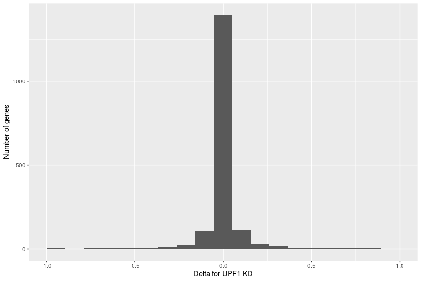
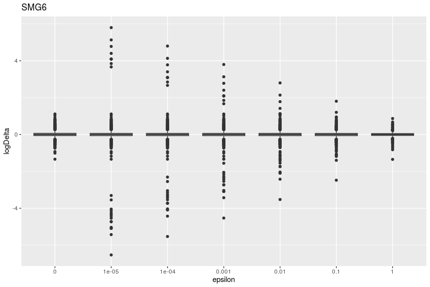
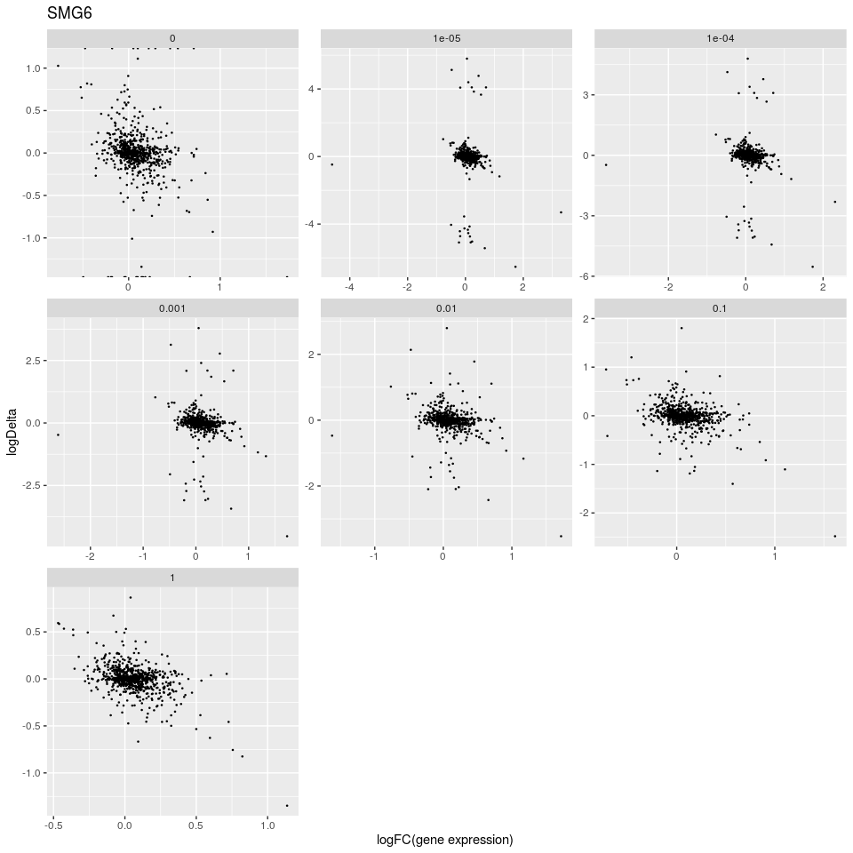

Plots
================

Data:

``` r
knitr::kable(head(target_counts_by_eps))
```

| gene\_id           | gene\_tpm\_control | gene\_tpm\_smg6 | gene\_tpm\_upf1 | uorftx\_tpm\_control | uorftx\_tpm\_smg6 | uorftx\_tpm\_upf1 | uorftx\_number | alltx\_number | frac\_control | frac\_smg6 | frac\_upf1 | eps |
| :----------------- | -----------------: | --------------: | --------------: | -------------------: | ----------------: | ----------------: | -------------: | ------------: | ------------: | ---------: | ---------: | --: |
| ENSG00000130939.14 |           4.803850 |        6.320538 |        6.534992 |             4.803850 |          6.320538 |          6.534992 |              3 |             4 |     1.0000000 |          1 |  1.0000000 |   0 |
| ENSG00000142655.8  |          40.879122 |       35.921655 |       32.434899 |            37.111135 |         35.921655 |         28.905457 |              1 |             2 |     0.9078261 |          1 |  0.8911838 |   0 |
| ENSG00000116688.12 |          24.696599 |       21.861144 |       29.798380 |            24.696599 |         21.861144 |         29.798380 |              2 |             2 |     1.0000000 |          1 |  1.0000000 |   0 |
| ENSG00000116691.6  |           1.627398 |        2.532337 |        8.175462 |             1.627398 |          2.532337 |          2.403440 |              1 |             2 |     1.0000000 |          1 |  0.2939822 |   0 |
| ENSG00000162458.8  |           0.564319 |        1.249094 |        0.838407 |             0.564319 |          1.249094 |          0.838407 |              4 |             5 |     1.0000000 |          1 |  1.0000000 |   0 |
| ENSG00000065526.6  |           5.375528 |        4.599448 |        6.179964 |             5.375528 |          4.599448 |          6.179964 |              1 |             1 |     1.0000000 |          1 |  1.0000000 |   0 |

Number of genes:

``` r
length(unique(target_counts_by_eps$gene_id))
```

    ## [1] 1771

### Logarithmic plots

SMG6 data by different \(\varepsilon\):

``` r
ggplot(data = target_counts_by_eps, mapping = aes(
  x = as.factor(eps), y = log10(frac_smg6) - log10(frac_control)
)) + geom_boxplot() + ggtitle('SMG6') + 
  xlab('epsilon') + ylab('Logarithmic delta')
```

    ## Warning: Removed 75 rows containing non-finite values (stat_boxplot).

<!-- -->

The same for UPF1 KD:

``` r
ggplot(data = target_counts_by_eps, mapping = aes(
  x = as.factor(eps), y = log10(frac_upf1) - log10(frac_control)
)) + geom_boxplot() + ggtitle('UPF1') + 
  xlab('epsilon') + ylab('Logarithmic delta')
```

    ## Warning: Removed 74 rows containing non-finite values (stat_boxplot).

<!-- -->

Delta against average gene expression in KD (SMG6) and control by
different \(\varepsilon\):

``` r
ggplot(data = target_counts_by_eps, mapping = aes(
  x = log10(gene_tpm_smg6 + gene_tpm_control),
  y = log10(frac_smg6) - log10(frac_control)
)) + geom_point(size = 0.25) + ggtitle('SMG6') +
  facet_wrap(~ as.factor(eps), scales = 'free', labeller = label_parsed) + 
  xlab('Average expression in KD and control') + ylab('Logarithmic delta')
```

    ## Warning: Removed 52 rows containing missing values (geom_point).

<!-- -->

How much genes have both uORF and non-uORF
transcripts?

``` r
keep <- target_counts_by_eps$uorftx_number != target_counts_by_eps$alltx_number
length(unique(target_counts_by_eps[keep, ]$gene_id))
```

    ## [1] 884

The same plots only for genes having non-uorf transcripts too:

``` r
ggplot(data = target_counts_by_eps[keep, ], 
       mapping = aes(
         x = log10(gene_tpm_smg6 + gene_tpm_control),
         y = log10(frac_smg6) - log10(frac_control)
)) + geom_point(size = 0.25) + ggtitle('SMG6') +
  facet_wrap(~ as.factor(eps), scales = 'free', labeller = label_parsed) + 
  xlab('Average expression in KD and control') + ylab('Logarithmic delta')
```

    ## Warning: Removed 41 rows containing missing values (geom_point).

<!-- -->

How much genes have non-zero
delta?

``` r
keep2 <- log10(target_counts_by_eps$frac_smg6) != log10(target_counts_by_eps$frac_control)
print(length(unique(target_counts_by_eps[keep2, ]$gene_id)))
```

    ## [1] 879

``` r
print(length(unique(target_counts_by_eps[keep & keep2, ]$gene_id)))
```

    ## [1] 879

So, this second condition filters out a bit more genes. Now, the last
plot (with filtering conditions) for logarithmic values: delta against
gene expression change

``` r
ggplot(data = na.omit(target_counts_by_eps[keep & keep2, ]), 
       mapping = aes(
         x = log10(gene_tpm_smg6 / gene_tpm_control),
         y = log10(frac_smg6) - log10(frac_control)
)) + geom_point(size = 0.25) + ggtitle('SMG6') +
  facet_wrap(~ factor(eps), scales = 'free') + 
  xlab('Expression change from control to KD') + ylab('Logarithmic delta')
```

<!-- -->

### Non-logarithmic plots

Boxplots for different \(\varepsilon\):

``` r
ggplot(data = target_counts_by_eps, mapping = aes(
  x = as.factor(eps), y = frac_smg6 - frac_control
)) + geom_boxplot() + ggtitle('SMG6') + 
  xlab('epsilon') + ylab('Delta')
```

    ## Warning: Removed 21 rows containing non-finite values (stat_boxplot).

<!-- -->

Delta against log of average expression in KD and control:

``` r
ggplot(data = target_counts_by_eps, mapping = aes(
  x = log10(gene_tpm_smg6 + gene_tpm_control),
  y = frac_smg6 - frac_control
)) + geom_point(size = 0.25) + ggtitle('SMG6') +
  facet_wrap(~ as.factor(eps), scales = 'free', labeller = label_parsed) + 
  xlab('Average expression in KD and control (log)') + ylab('Delta')
```

    ## Warning: Removed 21 rows containing missing values (geom_point).

<!-- -->

The same with filtering conditions:

``` r
ggplot(data = na.omit(target_counts_by_eps[keep & keep2, ]),
       mapping = aes(
         x = log10(gene_tpm_smg6 + gene_tpm_control),
         y = frac_smg6 - frac_control
)) + geom_point(size = 0.25) + ggtitle('SMG6') +
  facet_wrap(~ as.factor(eps), scales = 'free', labeller = label_parsed) + 
  xlab('Average expression in KD and control (log)') + ylab('Delta')
```

<!-- -->

Delta against gene expression change:

``` r
ggplot(data = na.omit(target_counts_by_eps[keep & keep2, ]), 
       mapping = aes(
         x = gene_tpm_smg6 / gene_tpm_control,
         y = frac_smg6 - frac_control
)) + geom_point(size = 0.25) + ggtitle('SMG6') +
  facet_wrap(~ factor(eps), scales = 'free') + 
  xlab('Expression change from control to KD') + ylab('Logarithmic delta')
```

<!-- -->

It’s better to avoid small values of \(\varepsilon\).
